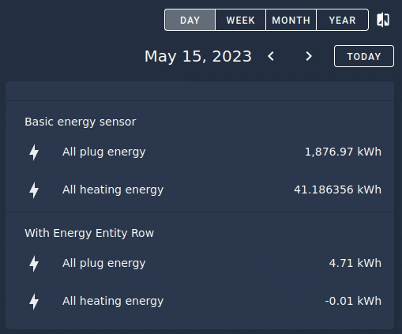

# energy-entity-row

[![GitHub Release][releases-shield]][releases]
[![License][license-shield]](LICENSE)
[](https://github.com/hacs/integration)

Display energy entities in an entity card row. This integrate with the builtin
[Energy Date Picker][energy-date-picker] (energy-date-selection)

For installation instructions [see this guide](https://github.com/thomasloven/hass-config/wiki/Lovelace-Plugins).

Install `energy-entity-row.js` as a `module`.

```yaml
resources:
  - url: /local/energy-entity-row.js
    type: module
```

## Usage example

**Note:** This is _not_ a card. It's a row for an [entities](https://www.home-assistant.io/lovelace/entities/).

**Note 2:** To work properly, an `energy-date-selection` card must be included
in the view



```yaml
- type: energy-date-selection
- type: entities
  entities:
    - type: section
      label: Basic energy sensor
    - entity: sensor.all_plug_energy
    - entity: sensor.all_heating_energy
    - type: section
      label: With Energy Entity Row
    - type: custom:energy-entity-row
      entity: sensor.all_plug_energy
    - type: custom:energy-entity-row
      entity: sensor.all_heating_energy
```


## Options

The following options can be added to the element:
- `round`: number of decimal to round numbers

In addition, all basic options can be used:
- `entity` (**required**)
- `name`
- `icon`
- `image`
- `type` (must be set to `custom:energy-entity-row`)

## Acknowlegements

Thanks to:
- Custom Card for the [boilerplate template][template]
- [thomasloven][thomasloven] for all its work and numerous example of lovelace elements
- MindFreeze for [ha-sankey-chart][sankey] which showed how to work with energy stats

[releases-shield]: https://img.shields.io/github/release/zeronounours/lovelace-energy-entity-row.svg?style=for-the-badge
[releases]: https://github.com/zeronounours/lovelace-energy-entity-row/releases
[license-shield]: https://img.shields.io/github/license/zeronounours/lovelace-energy-entity-row.svg?style=for-the-badge
[energy-date-picker]: https://www.home-assistant.io/dashboards/energy/#energy-date-picker
[template]: https://github.com/custom-cards/boilerplate-card
[thomasloven]: https://github.com/thomasloven
[sankey]: https://github.com/MindFreeze/ha-sankey-chart
